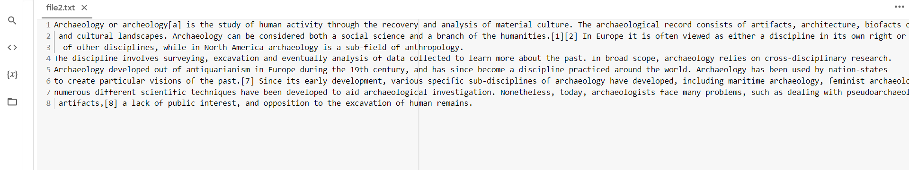

# copy-file
## AIM:
To write a python program for copying the contents from one file to another file.
## EQUIPEMENT'S REQUIRED: 
PC
Anaconda - Python 3.7
## ALGORITHM: 
### step 1:
start the program
### Step 2:
open file1.txt in read mode 
### Step 3: 
 assign para to fp.read() of file1.txt
### Step 4: 
again open a new file file2.txt in write mode
### Step 5:  
use write function to copy the file contents
### Step 6: 
end the program
## PROGRAM:
```
'''
Developed by Haridharshini.S
reference number:21500176
to write a python progam to copy a file
'''
with open("file1.txt","r") as fp:
  para=fp.read()
with open("file2.txt","w") as fp1:
  fp1.write(para)

```
### OUTPUT:


## RESULT:
Thus the program is written to copy the contents from one file to another file.